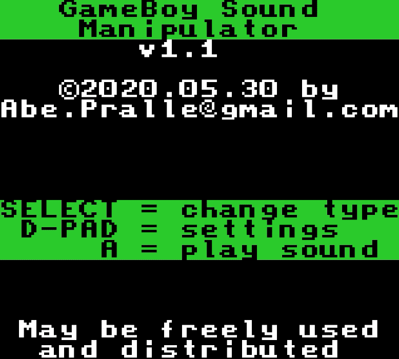
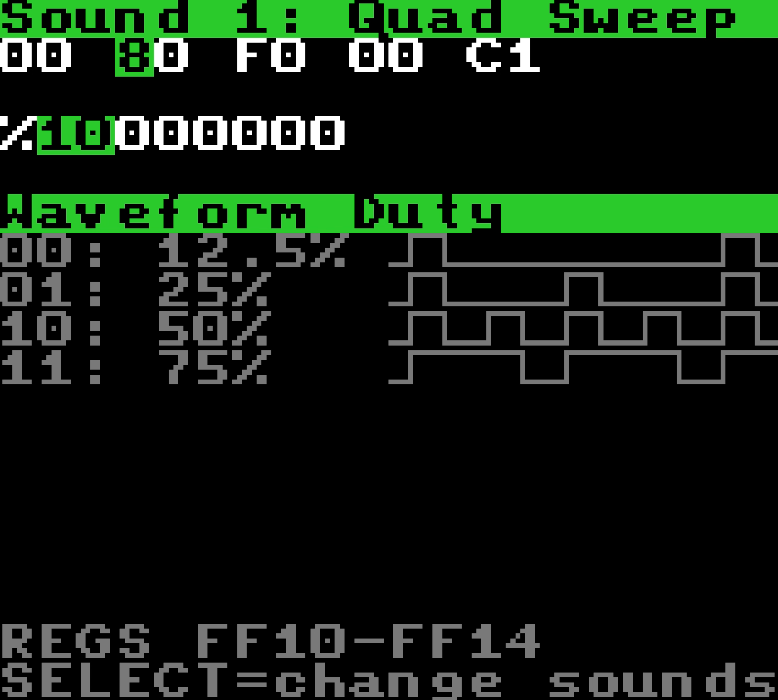

# Game Boy Sound Manipulator
A GameBoy Color ROM that provides on-device/on-emulator sound parameter editing.

About         | Current Release
--------------|-----------------------
Version       | 1.1.1
Date          | 2022.01.08
Target        | Game Boy Color
Build         | macOS, Windows, Linux
License       | [MIT License](LICENSE)

## ROM
- A compiled ROM is included: [ROM/GBSound.gb](ROM/GBSound.gb).
- Run it on a Game Boy Color emulator such as [SameBoy](https://sameboy.github.io).

## Compiling
1. Install the [Rogue](https://github.com/AbePralle/Rogue) language to utilize its Rogo build system.
2. If on Windows or Linux, install [RGBDS](https://github.com/rednex/rgbds). On macOS Rogo will install it for you.
3. Run `rogo` to build the ROM from source using RGBDS.

## Usage
If you are programming Game Boy or Game Boy Color, Game Boy Sound Manipulator (AKA GBSound) lets you adjust sound parameters with immediate feedback. Once you have dialed in a sound you like, copy the sound's bytes to the appropriate Game Boy registers to play that sound. For example, for the screen below you would copy bytes `00 80 F0 00 C1` to locations `FF10-FF14`.

## History
Version | Date             | Description
--------|------------------|------------------------------------------------------------------------------------------
v1.0    | March 6, 2000    | Original freeware version (compiled ROM only).
v1.1    | May 30, 2020     | Updated for modern RGBDS assembler, added GBC register info, and released as open source.
v1.1.1  | January 8, 2021  | Updated for latest RGBDS assembler.

